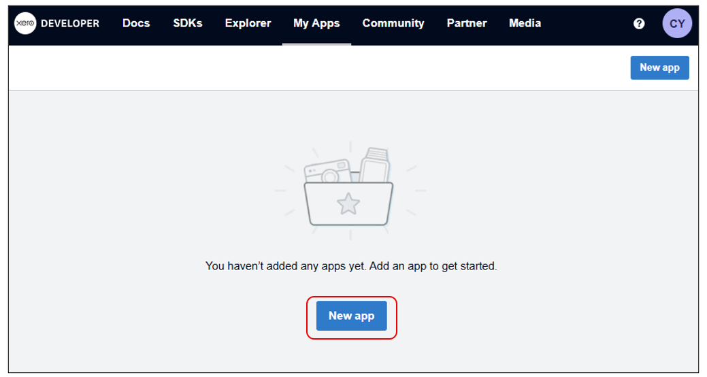
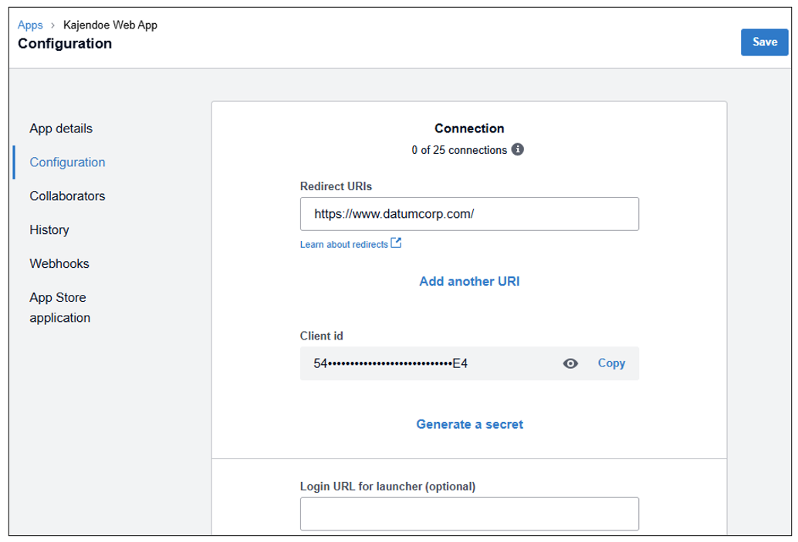
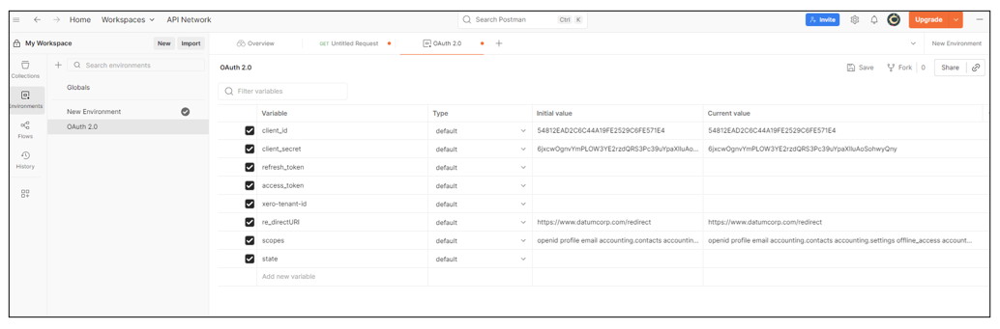
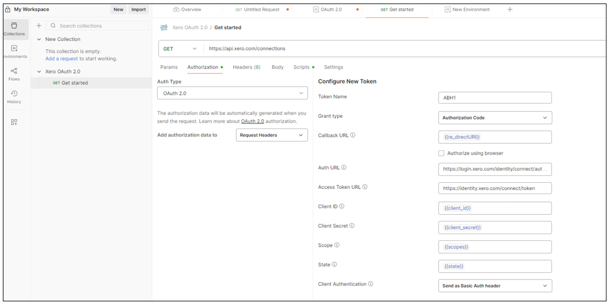
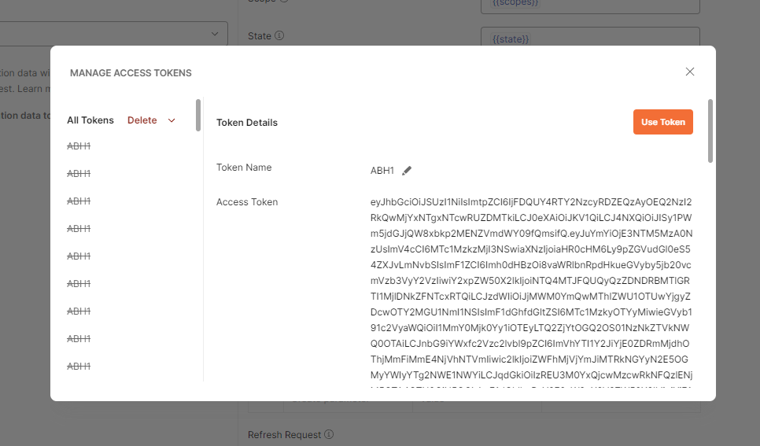
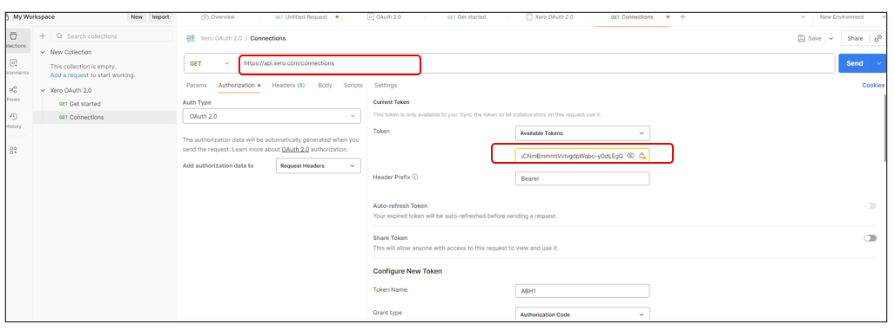
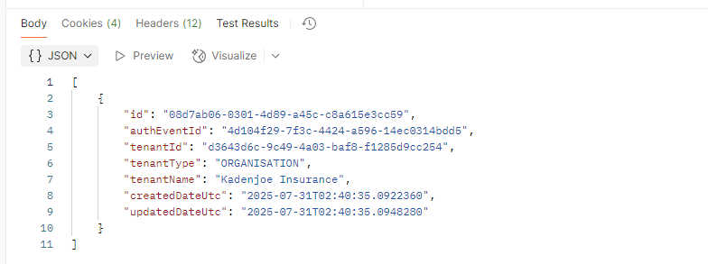
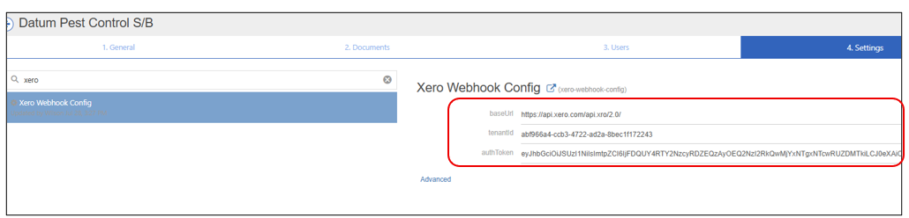

# README

This README file will guide you on setting up a Xero API account and obtain the parameters such Client Id, Secret Key, Access token and Tenant Id needed to use the Xero web hooks.
Then setup the Tenant Id, base Url and access token into web hook configuration settings.

## Setup Xero account and obtain Client Id, Client Secret key, Access Token and tenant ID 

1. 	Go to Xero developer portal: https://developer.xero.com/ and register an account. 

2.	After registering the account, verify your account by opening your email and click on the Activate account link.

    login to the account using your email and password at https://developer.xero.com/

3.  At the developer dashboard, click the **New App** button to create a new application.
    In the create app page, you will need to fill in App name, Integration type, Company or application url and redirect url.
    For Integration type, you can choose **Web app**.

    

    Tick the agreement checkbox and click **Create App** button.

4.  Then, at the left side menu, click **Configuration** option, you will see the page below.
    Click on the eye icon next to the **Client Id** and copy the Client Id into a text file, you will need to keep it.
    Click **Generate a secret** link and do the same click on the eye icon and copy it into the text file.
    Then, click the **Save** button at the top right to save this configuration.

     

5.  Now, you will need to configure the postman environment.
    Open Postman app, configure the environment variables for client_id, client_secret, redirect_URI and scopes with the details you have obtained in the previous steps.
    For scopes you can use this to start with: offline_access accounting.transactions openid profile email accounting.contacts accounting.settings accounting.settings.read accounting.journals.read accounting.transactions

    
    Make sure you have the OAuth 2.0 Environment selected.

    

6.  Now, you need to generate your access token.

    In postman app, click on the GET Get Started request under the Xero OAuth 2.0 Collection
    Select the Authorization tab
    Scroll down to the Configure New Token section

    Add the Variable names surrounded by {{}} from your Environment into the fields, as shown in the screenshot below

    Add https://login.xero.com/identity/connect/authorize to the Auth URL field
    
    Add https://identity.xero.com/connect/token to the Access Token Field
    
 
    Scoll to bottom and click **Get New Access Token**

    At this stage you will be prompted to log in to Xero.

    You’ll then be taken through to the Organisation Select window. If you’ve included the openid profile email scopes, you’ll also be asked to access your basic profile information. Select the organisation you want to connect to. If you want to connect to more than one organisation, you can repeat the steps above and select another organisation.

    At the end of this process, the token pop-up dialog will be displayed with the access token as show below.

    

    Copy and save the access token and refresh token into a text file, you will need them to configure the webhook settings later.

    Go back to postman app, configure the **access token** and **refresh token** into the environment collection. Then, save the environment setting.

7.  Now, you will need to get your tenant Id.

    Click on the GET Connections request.

    Key in the GET Url as https://api.xero.com/connections, and set the access token as shown below.

    

    Then, click the Send button.

    **Note: This Trial account token is only valid for 30 minutes, if you have clicked the Send button and it returns the token expired message, you will need scroll down and click **Get New Access Token** button to re-generate a new token. And then re-key in the token into the access token field.**

    If your send request is successful, it will return a JSON data with then tenant id, as shown below, copy the tenant id into text file and save it, you will need it to configure the webhook settings.

    


8.  Set the Xero API configurations 

    Login to system portal<br>
    Go to HQ Settings page, and click on the **Settings** tab.

    Create a new setting by configuring the followings:

    **Setting name**: Xero Webhook Config<br>
    **baseUrl**:    https://api.xero.com/api.xro/2.0/<br>
    **tenantId**:   [The tenand Id you have obtained]<br>
    **authToken**:  [The access Token you have obtained]<br>

    Note: This access token will expire in 30 minutes once it is generated, you will need to re-generate new access token and update this setting once it expires.

    

     
## Contact Web Hooks

### Create Contact Web Hook

**Webhook:** /h/xero-create-update-contact-item
<br>**API Method:** POST
<br>**Querystring parameter:** urlpath=Contacts

Required field in JSON payload to create a contact:<br>**Name**: Full name of contact/organisation (max length = 255)

Sample payload data:
```json
{
  "Contacts": [
    {
      "Name": "24 locks",
      "FirstName": "Ben",
      "LastName": "Bowden",
      "EmailAddress": "ben.bowden@24locks.com",
      "ContactPersons": [
        {
          "FirstName": "John",
          "LastName": "Smith",
          "EmailAddress": "john.smith@24locks.com",
          "IncludeInEmails": "true"
        }
      ],
      "Addresses": [
        {
          "AddressType": "STREET",
          "AddressLine1": "123 Main St",
          "City": "Anytown",
          "PostalCode": "12345"
        }
      ],
      "ContactNumber": "6037807344",
      "Phones": [
        {
          "PhoneType": "MOBILE",
          "PhoneNumber": "60162027348"
        }
      ],
    }
  ]
}
```
For further information on Xero Create Contact API submission, please refer to : https://developer.xero.com/documentation/api/accounting/contacts#post-contacts

If the contact is successfully created, it will return a JSON data with the contact Id, name, and other details along with the flags whether it is customer other supplier (isCustomer and isSupplier). When a contact is newly created, by default it is neither a customer, nor a supplier.

### Update Contact Web Hook

**Webhook:** /h/xero-create-update-contact-item
<br>**API Method:** POST
<br>**Querystring parameter:** urlpath=Contacts

Required field in JSON payload to create a contact:<br>**ContactID**

Sample payload data:

```json
{
  "ContactID": "eaa28f49-6028-4b6e-bb12-d8f6278073fc",
  "Name": "ABC Limited",
  "FirstName": "John",
  "LastName": "Smith",
  "EmailAddress": "john.smith@gmail.com",
  "Addresses": [
    {
      "AddressType": "POBOX",
      "AddressLine1": "P O Box 123",
      "City": "Wellington",
      "PostalCode": "6011"
    }
  ],
  "BankAccountDetails": "01-0123-0123456-00",
  "TaxNumber": "12-345-678",
  "AccountsReceivableTaxType": "OUTPUT",
  "AccountsPayableTaxType": "INPUT",
  "DefaultCurrency": "NZD"
}
```

The payload to update the contact is similar to that of create contact, except that it has an additional field of "ContactID" to designte which contact to update the details. If the ContactID is not provided, new contact will be created with the payload data.

### Get Contact Web Hook

**Webhook:** /h/xero-get-contacts
<br>**API Method:** GET
<br>**Querystring parameter:** contactid=[The Id of particular contact you wish to get], contacttype=[This can be 'customer' or 'supplier' contact]


If you omit any of these parameters, it will just retreive ALL contacts and/or ALL contacts types depending of which of the parameters you omitted.

**The following elements are returned in the Contacts response:**<br>
ContactID, ContactNumber, AccountNumber, ContactStatus, Name, EmailAddress, BankAccountDetails, TaxNumber, Addresses, Phones, IsSupplier, IsCustomer and etc.

For further information on Xero get Contact API, please refer to: https://developer.xero.com/documentation/api/accounting/contacts#get-contacts


## Item Web Hooks

### Create Item Web Hook

**Webhook:** /h/xero-create-update-contact-item
<br>**API Method:** POST
<br>**Querystring parameter:** urlpath=Items

Required field in JSON payload to create a Item:<br>**Code**: User defined item code (max length = 30)<br>

You can create or update a maximum of 500 items per request, although we recommend batches of 50-100 to optimise efficiency.

Sample payload data:

```json
{
  "Items": [
    {
      "Code": "Merino-2011-LG",
      "Name": "2011 Merino Sweater - LARGE",
      "Description": "LARGE size Merino Wool Sweater",
      "IsSold": true,
      "IsPurchased": true,
      "SalesDetails": {
        "UnitPrice": 100.00,
        "AccountCode": "200",
        "TaxType": "OUTPUT"
      },
      "PurchaseDetails": {
        "UnitPrice": 50.00,
        "AccountCode": "300",
        "TaxType": "INPUT"
      },
      "IsTrackedAsInventory": false
    }
  ]
}
```
For further information on Xero Create Items API submission, please refer to: https://developer.xero.com/documentation/api/accounting/items#post-items


### Update Item Web Hook

**Webhook:** /h/xero-create-update-contact-item
<br>**API Method:** POST
<br>**Querystring parameter:** urlpath=Items

Required field in JSON payload to create a Item:<br>**ItemID**

Sample payload data:

```json
{
      "Items": [
        {
          "ItemID": "your_item_id_here",
          "Code": "NEWCODE123",
          "Name": "Updated Product Name",
          "Description": "This is an updated description for the product.",
          "PurchaseDetails": {
            "UnitPrice": 15.00,
            "AccountCode": "400"
          },
          "SalesDetails": {
            "UnitPrice": 25.00,
            "AccountCode": "200"
          }
        }
      ]
    }
```

The payload to update the item is similar to that of create item, except that it has an additional field of "ItemID" to designate which item to update the details. If the ItemID is not provided, new item will be created with the payload data.

### Get Item Web Hook

Use this method to retrieve either one or many items.

**Webhook:** /h/xero-get-items
<br>**API Method:** GET
<br>**Querystring parameter:** itemid=[The Item Id or Item Code of particular item you wish to get]

**ItemID** – The Xero identifier for an Item
e.g. 297c2dc5-cc47-4afd-8ec8-74990b8761e9<br>
**Code** – The Code e.g. ITEM-001

If the querystring itemId is not provided, it will fetch ALL items.

Examples response when retrieving an individual item:

```json
{
  "Items": [
    {
      "ItemID": "9a59ea90-942e-484d-9b71-d00ab607e03b",
      "Code": "Merino-2011-LG",
      "Description": "2011 Merino Sweater - LARGE",
      "UpdatedDateUTC": "\/Date(1488338552390+0000)\/",
      "PurchaseDetails": {
        "UnitPrice": 149.0000,
        "AccountCode": "300"
      },
      "SalesDetails": {
        "UnitPrice": 299.0000,
        "AccountCode": "200"
      }
    }
  ]
}
```

Examples response when retrieving a collection of items

```json
{
  "Items": [
    {
      "ItemID": "19b79d12-0ae1-496e-9649-cbd04b15c7c5",
      "Code": "UnTrackedThing",
      "Description": "I sell this untracked thing",
      "PurchaseDescription": "I buy this untracked thing",
      "UpdatedDateUTC": "\/Date(1488338552390+0000)\/",
      "PurchaseDetails": {
        "UnitPrice": 20.0000,
        "AccountCode": "400",
        "TaxType": "NONE"
      },
      "SalesDetails": {
        "UnitPrice": 40.0000,
        "AccountCode": "200",
        "TaxType": "OUTPUT2"
      },
      "Name": "An Untracked Item",
      "IsTrackedAsInventory": false,
      "IsSold": true,
      "IsPurchased": true
    },
    {
      "ItemID": "90a72d44-43e4-410d-a68b-1139ef0c0c07",
      "Code": "TrackedThing",
      "Description": "I sell this tracked thing",
      "PurchaseDescription": "I purchase this tracked thing",
      "UpdatedDateUTC": "\/Date(1488338552390+0000)\/",
      "PurchaseDetails": {
        "UnitPrice": 20.0000,
        "COGSAccountCode": "430",
        "TaxType": "NONE"
      },
      "SalesDetails": {
        "UnitPrice": 40.0000,
        "AccountCode": "200",
        "TaxType": "OUTPUT2"
      },
      "Name": "Tracked Thing",
      "IsTrackedAsInventory": true,
      "InventoryAssetAccountCode": "630",
      "TotalCostPool": 200.00,
      "QuantityOnHand": 10.0000,
      "IsSold": true,
      "IsPurchased": true
    }
  ]
}
```

## Journal Web Hooks

### Create Journal Web Hook

Use this method to create a manual journal

**Webhook:** /h/xero-create-update-journal
<br>**API Method:** POST

Required fields in JSON payload to create a journal:<br>
**Narration**: Description of journal being posted<br>
**JournalLines**: The JournalLines element must contain at least two individual JournalLine sub-elements.

Recommended field in JSON payload request:<br>
**Date**: Date journal was posted – YYYY-MM-DD. Defaults to the current date if not provided

Mandatory elements for Journal Lines:<br>
**LineAmount**:total for line. Debits are positive, credits are negative value
**AccountCode**: Account code for the journal line

There are a few accounts that you can't use when entering manual journals in Xero. These include system accounts (accounts receivable, accounts payable & retained earnings) and bank accounts. You will receive a 400 validation error if you try and use these reserved accounts

Sample payload data:

```json
{
  "Date": "2015-08-13",
  "Status": "DRAFT",
  "Narration": "Prepaid our phone a year in advance",
  "LineAmountTypes": "NoTax",
  "JournalLines": [
    {
      "Description": "Prepaid Annual Phone",
      "LineAmount": -1000,
      "AccountCode": "489",
      "TaxType": "NONE"     
    },
    {
      "Description": "Prepayment",
      "LineAmount": 1000,
      "AccountCode": "620",
      "TaxType": "NONE"     
    }
  ],
  "ShowOnCashBasisReports": "false"
}
```

Once the journal is created successfully, it will return a JSON data with the details such has Journal id, narration, Journalines and etc.

### Update Journal Web Hook

**Webhook:** /h/xero-create-update-journal<br>
**API Method:** POST<br>
**Querystring parameters**:  journalid=[The Id of particular journal you wish to update]

Note: If you do not provide the journal Id, Xero will create a new journal with the payload data provided.

Required fields in JSON payload to create a journal:<br>
**Narration**: Description of journal being posted<br>
**JournalLines**: The JournalLines element must contain at least two individual JournalLine sub-elements.

Recommended field in JSON payload request:<br>
**Date**: Date journal was posted – YYYY-MM-DD. Defaults to the current date if not provided

Mandatory elements for Journal Lines:<br>
**LineAmount**:total for line. Debits are positive, credits are negative value
**AccountCode**: Account code for the journal line

Sample payload data:

```json
{
  "Narration": "Updated narration for the journal",
  "Status": "DRAFT",
  "LineAmountTypes": "NoTax",
  "JournalLines": [
    {
      "LineAmount": 150.00,
      "AccountCode": "400",
      "Description": "Updated expense line item",
      "TaxType": "NONE",
    },
    {
      "LineAmount": -150.00,
      "AccountCode": "200",
      "Description": "Updated asset line item",
      "TaxType": "NONE",
    }
  ]
}
```

### Get Journal Web Hook

Use this method to retrieve either one or many manual journals.

**Webhook:** /h/xero-get-journals
<br>**API Method:** GET
<br>**Querystring parameter:** journalid=[The Id of particular journal you wish to update], type={The type of journal you want to fetch, Manual journal or System generated journal ('Journals' or 'ManualJournals') }

Sample JSON response:<br>

```json
{
  "ManualJournals": [
    {
      "Date": "\/Date(1486166400000+0000)\/",
      "Status": "DRAFT",
      "LineAmountTypes": "NoTax",
      "UpdatedDateUTC": "\/Date(1291226902527+0000)\/",
      "ManualJournalID": "99ff1108-2d9a-4955-ac7e-e705aa1b9547",
      "Narration": "Prepaid our insurance a year in advance",
      "ShowOnCashBasisReports": true
    },{
      "Date": "\/Date(1488240000000+0000)\/",
      "Status": "POSTED",
      "LineAmountTypes": "NoTax",
      "UpdatedDateUTC": "\/Date(1291227505357+0000)\/",
      "ManualJournalID": "e5f09a63-62db-4739-af7c-1deda351ed5a",
      "Narration": "Prepaid our phone a year in advance",
      "ShowOnCashBasisReports": true
    }
  ]
}

```

## Invoice Web Hooks

### Create Invoice Web Hook

Use this web hook to create an invoice

**Webhook:** /h/xero-create-update-invoice<br>
**API Method:** POST

**The following are required to create a draft invoice**:<br>
**Type:** Either ACCPAY (Account payable invoice) or ACCREC (Account receivable invoice)<br>
**Contact:** This can be either a contact Id or contact name. If contact id is give, the newly created invoice will be associated with the contact. If contact name is given, a new contact will be created along with the invoice.<br>
**LineItems:** The LineItems collection can contain any number of individual LineItem sub-elements. At least **one** is required to create a complete Invoice

Sample payload data:

```json
{
      "Type": "ACCREC",
      "Contact": {
        "ContactID": "4b7f0e96-64e5-4ef2-b9e1-1f9a2e8ab36c"
      },
      "Date": "2025-04-23",
      "DueDate": "2025-08-30",
      "LineAmountTypes": "Exclusive",
      "Reference": "",
      "Status": "AUTHORISED",
      "LineItems": [
        {
          "Description": "20 Tonnes Ammonium Nitrates",
          "Quantity": 100,
          "UnitAmount": 500.00,
          "AccountCode": "200"
        }
      ]
    }
```

Note: If you put ContactID in the "Contact" section of this JSON payload, an invoice will be created for this particular contact. You can also put "Name" instead, a new contact will be created with this name for this invoice.

For further information on xero invoice, please refer to : https://developer.xero.com/documentation/api/accounting/invoices#post-invoices

### Update Invoice Web Hook

Use this web hook to update an invoice

**Webhook:** /h/xero-create-update-invoice<br>
**API Method:** POST

**Similar to create Invoice, the following are required to update an invoice**:<br>
**Type:** Either ACCPAY (Account payable invoice) or ACCREC (Account receivable invoice)<br>
**Contact:** This can be either a contact Id or contact name. If contact id is give, the newly created invoice will be associated with the contact. If contact name is given, a new contact will be created along with the invoice.<br>
**LineItems:** The LineItems collection can contain any number of individual LineItem sub-elements. At least **one** is required to create a complete Invoice

Sample payload data:

```json
{
        "Invoices": [
            {
                "InvoiceID": "YOUR_INVOICE_ID",
                "Contact": {
                    "ContactID": "YOUR_CONTACT_ID"
                },
                "Date": "2025-07-29",
                "DueDate": "2025-08-15",
                "LineItems": [
                    {
                        "Description": "Updated Product A",
                        "Quantity": 2,
                        "UnitAmount": 50.00,
                        "AccountCode": "200"
                    },
                    {
                        "Description": "New Service B",
                        "Quantity": 1,
                        "UnitAmount": 100.00,
                        "AccountCode": "300"
                    }
                ],
                "Type": "ACCREC",
                "Status": "AUTHORISED"
            }
        ]
    }
```

For further information on xero invoice, please refer to : https://developer.xero.com/documentation/api/accounting/invoices#post-invoices

### Get Invoice Web Hook

Use this method to retrieve one or many invoices.

**Webhook:** /h/xero-get-invoice<br>
**API Method:** GET<br>
**Querystring parameters**:  id=[The Id of particular item you wish to get], type=[ACCPAY or ACCREC], status=[DRAFT,AUTHORISED, SUBMITTED]

When you retrieve multiple invoices, only a summary of the contact is returned and no line details are returned – this is to keep the response more compact.
The line item details will be returned when you retrieve an individual invoice, either by specifying Invoice ID, Invoice Number.

Sample JSON response:

```json

{
  "Invoices": [
    {
      "Type": "ACCREC",
      "Contact": {
        "ContactID": "025867f1-d741-4d6b-b1af-9ac774b59ba7",
        "ContactStatus": "ACTIVE",
        "Name": "City Agency",
        "Addresses": [
            { "AddressType": "STREET" },
            {
              "AddressType": "POBOX",
              "AddressLine1": "L4, CA House",
              "AddressLine2": "14 Boulevard Quay",
              "City": "Wellington",
              "PostalCode": "6012"
            }
          ],
        "Phones": [
            { "PhoneType": "DEFAULT" },
            { "PhoneType": "DDI" },
            { "PhoneType": "MOBILE" },
            { "PhoneType": "FAX" }
          ],
        "UpdatedDateUTC": "\/Date(1518685950940+0000)\/",
        "IsSupplier": "false",
        "IsCustomer": "true"
      },
      "Date": "\/Date(1518685950940+0000)\/",
      "DateString": "2009-05-27T00:00:00",
      "DueDate": "\/Date(1518685950940+0000)\/",
      "DueDateString": "2009-06-06T00:00:00",
      "Status": "AUTHORISED",
      "LineAmountTypes": "Exclusive",
      "LineItems": [
        {
          "ItemCode": "12",
          "Description": "Onsite project management ",
          "Quantity": "1.0000",
          "UnitAmount": "1800.00",
          "TaxType": "OUTPUT",
          "TaxAmount": "225.00",
          "LineAmount": "1800.00",
          "AccountCode": "200",
          "AccountId": "4f2a3169-8454-4012-a642-05a88ef32982",
          "Item": {
                        "ItemID": "fed07c3f-ca77-4820-b4df-304048b3266f",
                        "Name": "Test item",
                        "Code": "12"
                    },
          "Tracking": [
            {
              "TrackingCategoryID": "e2f2f732-e92a-4f3a9c4d-ee4da0182a13",
              "Name": "Activity/Workstream",
              "Option": "Onsite consultancy"
            }
          ],
          "LineItemID": "52208ff9-528a-4985-a9ad-b2b1d4210e38"
        }
      ],
      "SubTotal": "1800.00",
      "TotalTax": "225.00",
      "Total": "2025.00",
      "UpdatedDateUTC": "\/Date(1518685950940+0000)\/",
      "CurrencyCode": "NZD",
      "InvoiceID": "243216c5-369e-4056-ac67-05388f86dc81",
      "InvoiceNumber": "OIT00546",
      "Payments": [
        {
          "Date": "\/Date(1518685950940+0000)\/",
          "Amount": "1000.00",
          "PaymentID": "0d666415-cf77-43fa-80c7-56775591d426"
        }
      ],
      "AmountDue": "1025.00",
      "AmountPaid": "1000.00",
      "AmountCredited": "0.00"
    }
  ]
}

```

### Apply Payment to Invoice

Apply payments to approved AR and AP invoices

**Webhook:** /h/xero-invoice-payment<br>
**API Method:** POST<br>

Sample payload:

```json
{
  "Invoice": {
    "InvoiceID": "d6855467-667c-466c-a4db-d6c21e6a86e7"
  },
  "Account": {
    "AccountID": "562555f2-8cde-4ce9-8203-0363922537a4"
  },
  "Amount": 3000.00,
  "Date": "2025-07-23T00:00:00",
  "Reference": "Payment for invoice d6855467-667c-466c-a4db-d6c21e6a86e7"
}
```


### Update Status and Void Invoice

You can delete a DRAFT or SUBMITTED invoice by updating the Status to DELETED.<br>
If an invoice has been AUTHORISED it cannot be deleted but you can set it's status to VOIDED

**Webhook:** /h/xero-void-invoices<br>
**API Method:** POST<br>

You can apply InvoiceID or InvoiceNumber in the payload to void or set status.

Sample payload JSON:

```json

{
  "Invoices":[
    {
      "InvoiceID":"3cd56ea2-10af-415c-b04f-0cb3373e4c60",
      "Status":"AUTHORISED"
    }
  ]
}

{
    "InvoiceNumber": "INV-123",
    "Status": "VOIDED"
}

```


## Credit Note Web Hooks

### Create Credit Note Web Hook

Use this method to create a credit note.

**Webhook**: /h/xero-create-credit-note<br>
**API Method**: POST

Sample payload data:

```json
{
  "CreditNotes": [
    {
      "Type": "ACCRECCREDIT", 
      "Contact": {
        "ContactID": "4b7f0e96-64e5-4ef2-b9e1-1f9a2e8ab36c" 
      },
      "Date": "2025-07-23",
      "Status": "AUTHORISED",
      "LineItems": [
        {
          "Description": "Credit 1 to Chem Fertiliser",
          "Quantity": 100,
          "UnitAmount": 1000.00,
          "AccountCode": "200" 
        }
      ]
    },
     {
      "Type": "ACCRECCREDIT", 
      "Contact": {
        "ContactID": "4b7f0e96-64e5-4ef2-b9e1-1f9a2e8ab36c" 
      },
      "Date": "2025-07-23",
      "Status": "AUTHORISED",
      "LineItems": [
        {
          "Description": "Credit 2 to Chem Fertiliser",
          "Quantity": 200,
          "UnitAmount": 1000.00,
          "AccountCode": "200" 
        }
      ]
    }
  ]
}
```

### Get Credit Note Web Hook

This web hooks fetches individual or multiple credit notes.

**Webhook:** /h/get-credit-note<br>
**API Method:** GET<br>
**Querystring parameters:**  id=[The Id of the particular credit note you wish to get]. If you omit this parameter, all credit notes will be fetched.

Example JSON response of get multiple credit notes:

```json

{
  "CreditNotes": [
    {
      "Contact": {
        "ContactID": "c6c7b870-bb4d-489a-921e-2f0ee4192ff9",
        "Name": "Test Apply Credit Note"
      },
      "DateString": "2016-12-16T00:00:00",
      "Date": "\/Date(1481846400000+0000)\/",
      "Status": "PAID",
      "LineAmountTypes": "Inclusive",
      "SubTotal": 86.96,
      "TotalTax": 13.04,
      "Total": 100.00,
      "UpdatedDateUTC": "\/Date(1290168061547+0000)\/",
      "CurrencyCode": "NZD",
      "FullyPaidOnDate": "\/Date(1481846400000+0000)\/",
      "Type": "ACCRECCREDIT",
      "CreditNoteID": "aea95d78-ea48-456b-9b08-6bc012600072",
      "CreditNoteNumber": "CN-0002",
      "CurrencyRate": 1.000000,
      "RemainingCredit": 0.00,
      "Allocations": [
        {
          "AllocationID": "b12335f4-a1e5-4431-aeb4-488e5547558e",
          "Amount": 100.00,
          "Date": "\/Date(1481846400000+0000)\/",
          "Invoice": {
            "InvoiceID": "87cfa39f-136c-4df9-a70d-bb80d8ddb975",
            "InvoiceNumber": "INV-0001"
          }
        }
      ]
    }
  ]
}

```

Example response of get an individual CreditNote:

```json
{
  "CreditNotes": [
    {
      "Contact": {
        "ContactID": "d0cd2c4f-18a0-4f7c-a32a-2db00f29d298",
        "ContactStatus": "ACTIVE",
        "Name": "PC Complete"
        ...
      },
      "DateString": "2017-02-07T00:00:00",
      "Date": "\/Date(1486425600000+0000)\/",
      "DueDate": "\/Date(1486425600000+0000)\/",
      "Status": "PAID",
      "LineAmountTypes": "Exclusive",
      "LineItems": [
        {
          "Description": "Internal DVD drive couldn't be supplied, backorder (Oliver laptop)",
          "UnitAmount": 199.00,
          "TaxType": "INPUT",
          "TaxAmount": 19.90,
          "LineAmount": 199.00,
          "AccountCode": "453",
          "AccountId": "fc8f0c5e-a3dc-4de3-ab8d-37ae0e5d152f",
          "Tracking": [
            {
              "Name": "Region",
              "Option": "North",
              "TrackingCategoryID": "093af706-c2aa-4d97-a4ce-2d205a017eac",
              "TrackingOptionID": "3f05cdf9-246b-46a2-bf6f-441da1b09b89"
            }
          ],
          "Quantity": 1.0000
        }
      ],
      "SubTotal": 199.00,
      "TotalTax": 19.90,
      "Total": 218.90,
      "UpdatedDateUTC": "\/Date(1290777947340+0000)\/",
      "CurrencyCode": "AUD",
      "FullyPaidOnDate": "\/Date(1486425600000+0000)\/",
      "Type": "ACCPAYCREDIT",
      "RemainingCredit": 0.00,
      "Allocations": [
        {
          "AllocationID": "b12335f4-a1e5-4431-aeb4-488e5547558e",
          "Amount": 218.90,
          "Date": "\/Date(1486425600000+0000)\/",
          "Invoice": {
            "InvoiceID": "673dd7cc-beb7-4697-83d4-0c47cb400cc2"
          }
        }
      ],
      "HasAttachments": false,
      "CreditNoteID": "7df8949c-b71f-40c0-bbcf-39f2f450f286",
      "CreditNoteNumber": "03391"
    }
  ]
}

```


### Allocate Credit Note to Invoice Web Hook

The elements required to allocate a credit note to an invoice:<br>
Invoice Id (The invoice id you wish to offset with the credit note)<br>
Credit note Id (The id of the credit note you wish to use to offset the invoice)
The amount (The amount you wish to off set)

Credit notes must have a Status of AUTHORISED to be available for allocation.

**Webhook:** /h/xero-credit-note-to-invoice<br>
**API Method:** GET<br>
**Querystring parameters:**<br>
cid=[The id of the credit note you wish to use to offset the invoice],<br>
invid=[ The id of the invoice you wish to offset with the credit note],<br>
amount=[The amount you wish to offset ] 


